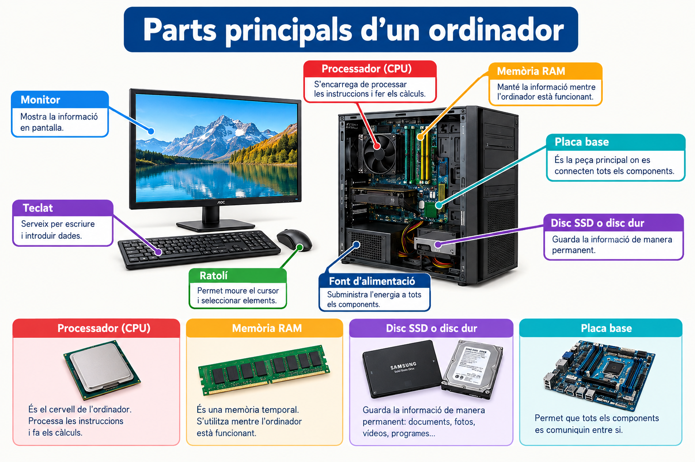

Què és un ordinador i com funciona?

Nom: Jean
Curs: SMX
Data: 2 d'octubre de 2026

Índex
Què és un ordinador?
Parts principals d'un ordinador
Els perifèrics
El sistema operatiu
Com funciona un ordinador?
Seguretat informàtica
Conclusions
Bibliografia
1. Què és un ordinador?

Un ordinador és una màquina electrònica que serveix per guardar, processar i mostrar informació.

Podem utilitzar un ordinador per:

Escriure documents.
Navegar per Internet.
Mirar vídeos.
Jugar.
Fer treballs.
Guardar fotografies i documents.
Comunicar-nos amb altres persones.
2. Parts principals d'un ordinador
Processador (CPU)

La CPU és una de les parts més importants de l'ordinador. S'encarrega de processar les instruccions i fer els càlculs.

Es pot comparar amb el cervell de l'ordinador.

Memòria RAM

La RAM és una memòria que l'ordinador utilitza mentre està funcionant.

Per exemple, quan obrim un programa, aquest utilitza part de la memòria RAM.

Disc SSD o disc dur

Serveix per guardar informació, com:

Fotografies
Documents
Vídeos
Programes
Jocs

Els discs SSD normalment són més ràpids que els discs durs tradicionals.

Placa base

La placa base és la peça principal on es connecten molts dels components de l'ordinador.

Permet que les diferents parts de l'ordinador es comuniquin entre elles.

3. Els perifèrics

Els perifèrics són dispositius que connectem a l'ordinador per introduir o obtenir informació.

Perifèric	Funció
Teclat	Escriure
Ratolí	Moure el cursor i seleccionar
Monitor	Mostrar informació
Impressora	Imprimir documents
Auriculars	Escoltar so
Micròfon	Gravar o transmetre veu
Càmera web	Fer videotrucades

4. El sistema operatiu

El sistema operatiu és el programa principal que permet utilitzar l'ordinador.

Alguns sistemes operatius coneguts són:

Windows
macOS
Linux
ChromeOS

El sistema operatiu permet obrir programes, gestionar fitxers, connectar dispositius i controlar diferents parts de l'ordinador.

5. Com funciona un ordinador?

De manera senzilla, podem explicar el funcionament d'un ordinador en tres passos:

Entrada → Processament → Sortida

Per exemple, quan escrivim una paraula:

Teclat → CPU → Pantalla

Primer escrivim amb el teclat. Després, l'ordinador processa la informació i finalment mostra la paraula a la pantalla.

6. Seguretat informàtica

La seguretat informàtica serveix per protegir els nostres dispositius i la nostra informació.

Alguns consells importants són:

Utilitzar contrasenyes segures.
Mantenir l'ordinador actualitzat.
No descarregar fitxers de llocs desconeguts.
No obrir enllaços sospitosos.
Utilitzar eines de seguretat quan sigui necessari.
Fer còpies de seguretat dels fitxers importants.

També és important no compartir les nostres contrasenyes amb altres persones.

7. Conclusions

Els ordinadors són eines molt importants en la nostra vida quotidiana. Ens permeten treballar, estudiar, comunicar-nos i divertir-nos.

Perquè un ordinador funcioni correctament, necessita diferents components, com la CPU, la RAM, el disc d'emmagatzematge i la placa base.

També és important utilitzar els ordinadors de manera segura i protegir la nostra informació personal.

8. Bibliografia
Material de classe de SMX.
Documentació educativa sobre informàtica.
Documentació dels fabricants de components informàtics.
Recursos educatius sobre tecnologia i seguretat informàtica.